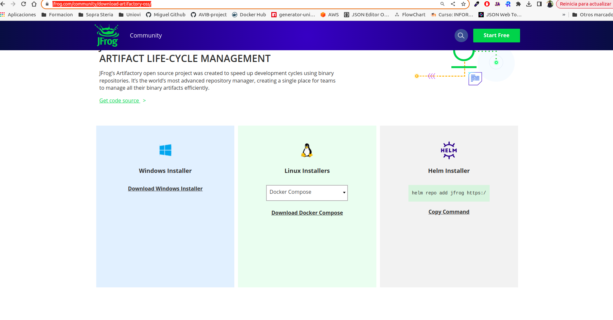
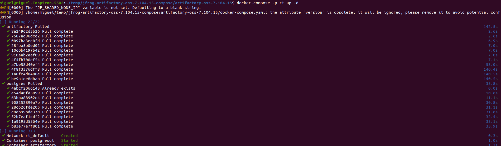
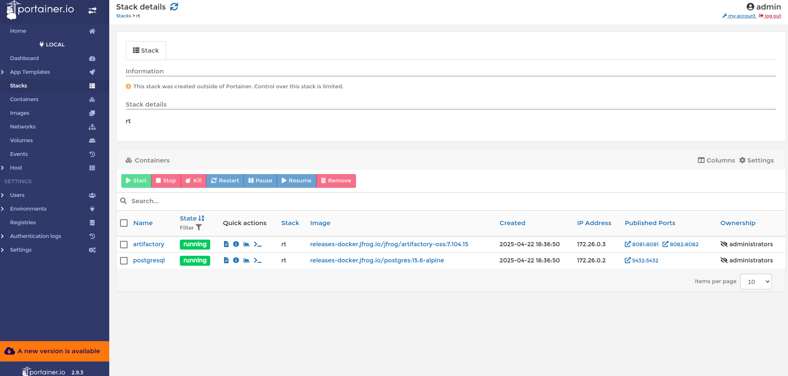
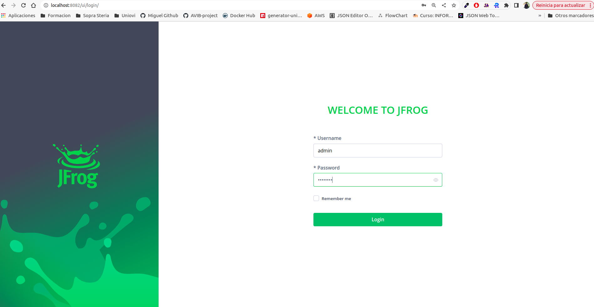
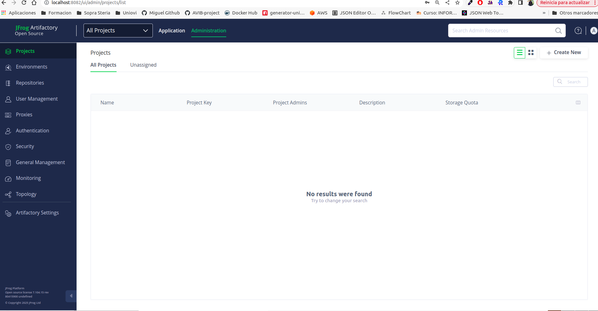

# Description
DoC install Artifactory Single Node with docker-compose

# Steps
Steps to be followed

## STEP01: download resources

Download the artifactory resources for the OSS version (Open Source). Go to this link and select docker-compose

```
https://jfrog.com/community/download-artifactory-oss/
```

 

## STEP02: untar the file and select docker compose

Untar the file and select the docker comose yaml file called docker-compose-volumes.yaml. Go 

```
$ tar -xvf jfrog-artifactory-oss-7.104.15-compose.tar.gz
$ cd jfrog-artifactory-oss-7.104.15-compose/artifactory-oss-7.104.15
$ cp ./templates/docker-compose-volumes.yaml ./docker-compose.yaml
```

## STEP03: create default volumes 

Create default volumes for postgreSQL and Artifactory

```
$ docker volume create --name=artifactory_data
$ docker volume create --name=postgres_data

```

## STEP04: execute docker compose

Execute docker compose and set rt name for the new stack

```
$ docker-compose -p rt up -d
```




## STEP05: Login and configure

Login in the Artifactory Web
```
http://localhost:8082/ui/
```
Default password is: **admin/password**



## STEP06: Post installation

A new configuration wizard will start. Define the new password and skip the rest of steps



## STEP07: Remove arfifactory

If you want remove artifactory execute this command:

```
$ docker-compose -p rt down --rmi all -v
```

# Some links 

- https://jfrog.com/community/download-artifactory-oss/
- https://jfrog.com/help/r/jfrog-installation-setup-documentation/artifactory-single-node-docker-compose-installation-using-docker-volumes